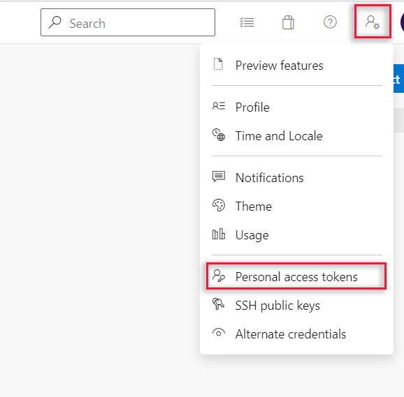
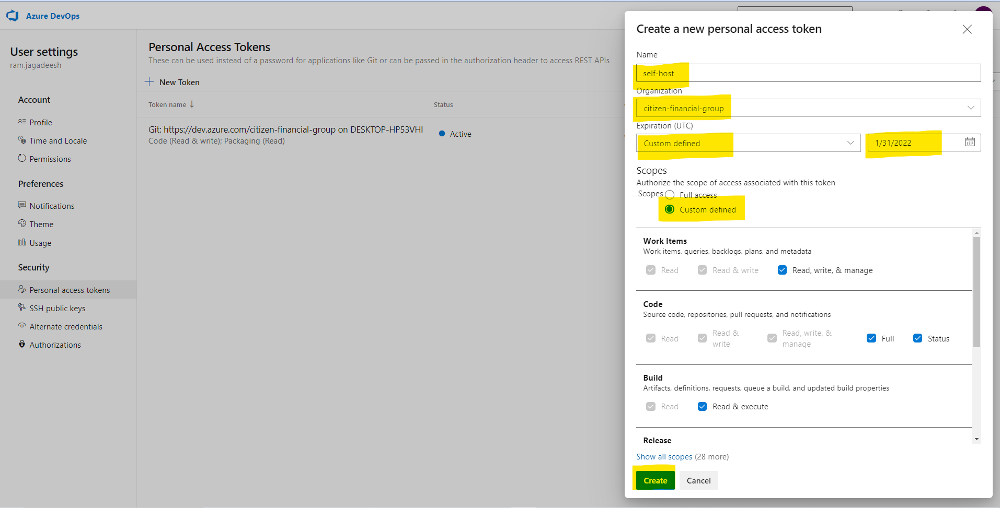
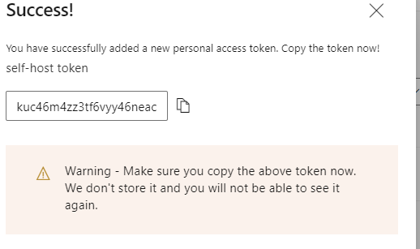
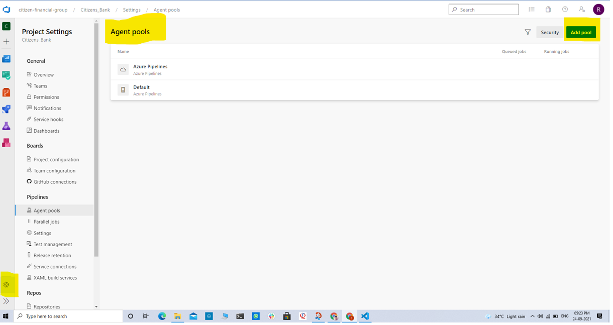
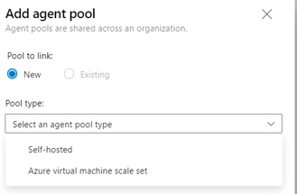
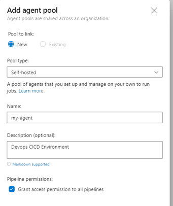
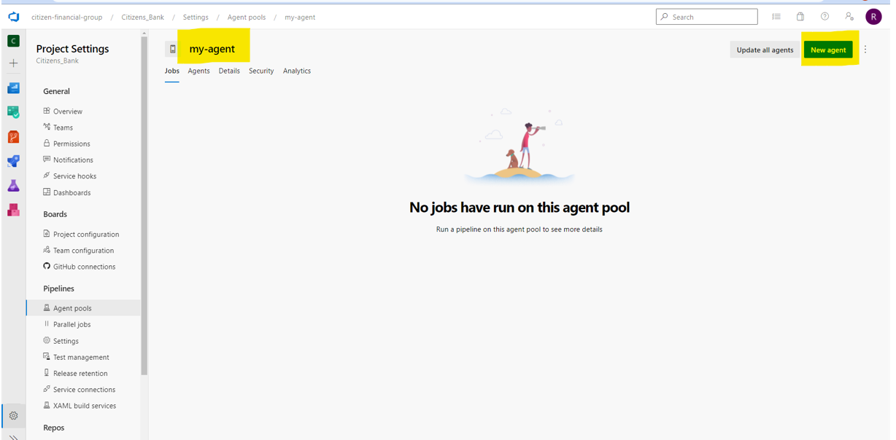
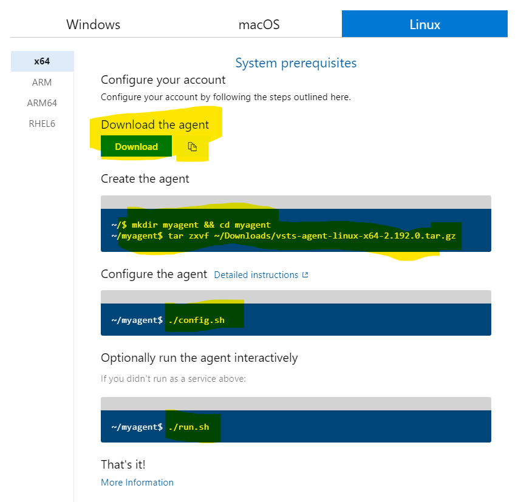
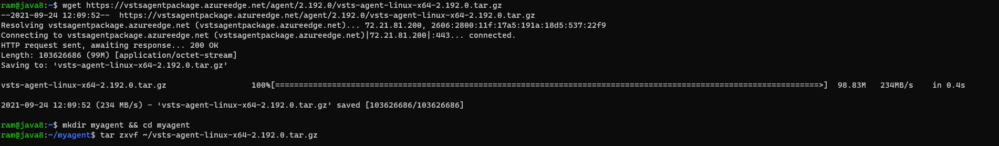

## Azure Agent pool 
* Self-hosted
* Virtualmachine scale set

## Authenticate with a personal access token (PAT)
* Sign in with the user account you plan to use in your Azure DevOps organization (https://dev.azure.com/{your_organization}).
* From your home page, open your user settings, and then select Personal access tokens.


### Create a personal access token



### Token copy ```4gmqpksh2mj3z3o72ytqilgejbhxnqn5nmtcoz4ion453ajmu4oq```

* For the scope select Agent Pools (read, manage) and make sure all the other boxes are cleared. If it's a deployment group agent, for the scope select Deployment group (read, manage) and make sure all the other boxes are cleared.

* Select Show all scopes at the bottom of the Create a new personal access token window window to see the complete list of scopes.

* Copy the token. You'll use this token when you configure the agent

## Choose Azure DevOps, Organization settings


## Choose Agent pools




## Select Add Agent 


## Follow the instructions on the page


## Download and configure the agent


## Run the agent ``` ./run.sh ```


4gmqpksh2mj3z3o72ytqilgejbhxnqn5nmtcoz4ion453ajmu4oq


